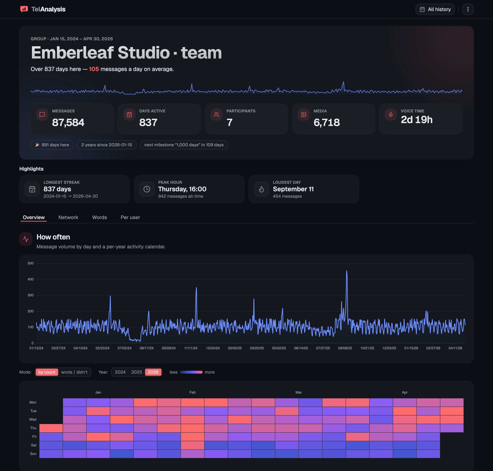
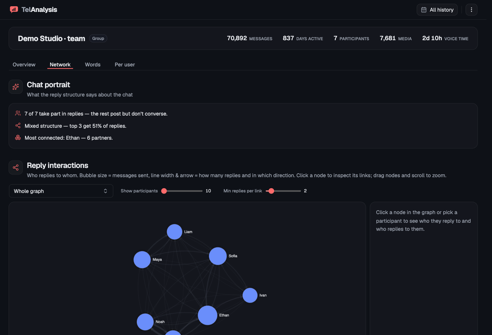
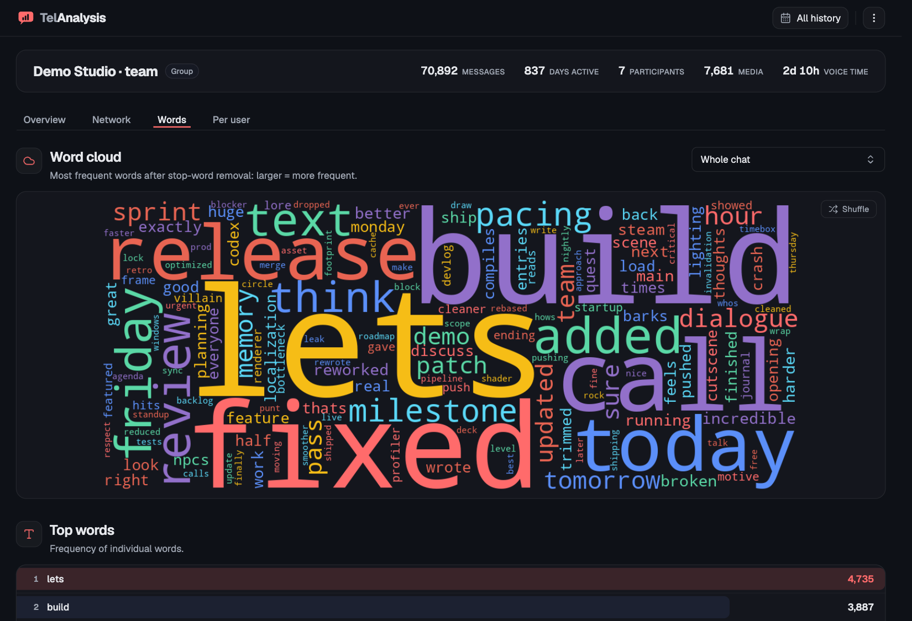
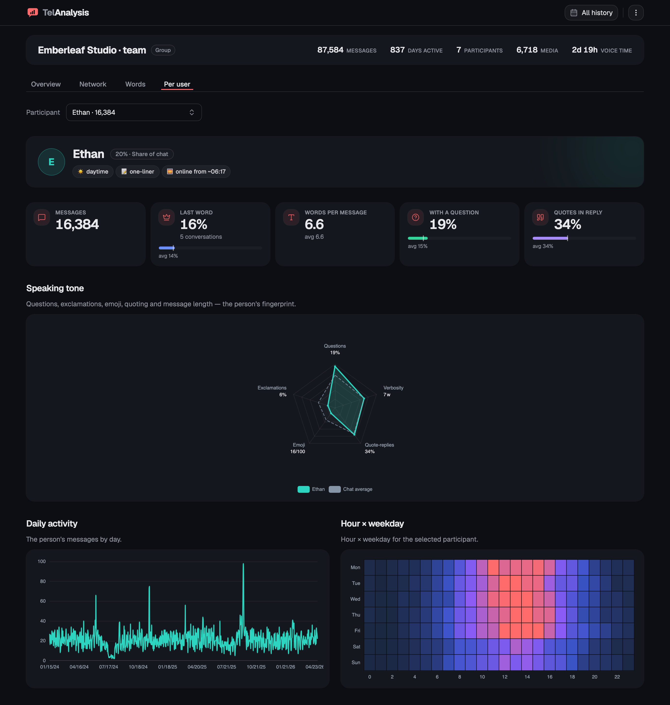
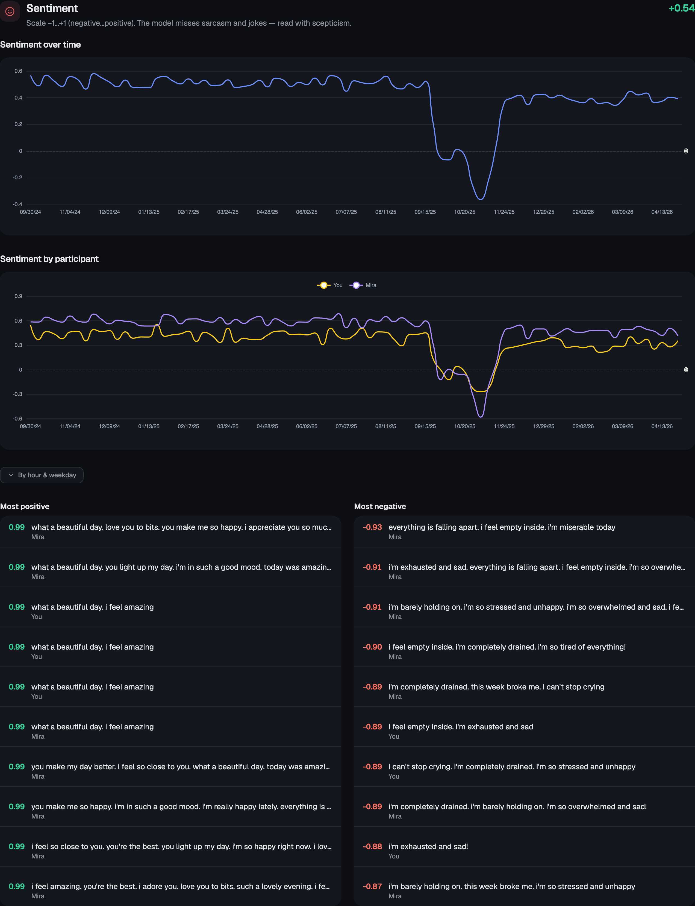

<div align="right">

**English** · [Русский](README.ru.md)

</div>

# TelAnalysis

[](https://github.com/emylfy/TelAnalysis/actions/workflows/ci.yml)


> Streamlit dashboard for analysing Telegram chat exports — runs entirely on your machine. Drop in `result.json`, get heatmaps, network graphs, word clouds, reply latency, sentiment arcs, and per-user breakdowns.

<p align="center">
  
</p>

## What it does

Reads a Telegram desktop export (single chat or full archive) and renders an interactive dashboard. Tabs adapt to chat type — channels get broadcast-style stats, groups get the network graph and per-user breakdown, 1-on-1 chats get matched-pair analytics.

Both export shapes are supported:
- **Single chat** — `Settings → Export Chat History`
- **Full archive** — `Settings → Advanced → Export Telegram Data` → a chat picker appears in the sidebar

UI ships in **RU / EN** (toggle in the sidebar). Chat content is left untouched — wordclouds and message previews show whatever language the messages are in.

## Features

| Tab | What you get |
| --- | --- |
| **Overview** | KPI cards (messages, participants, days active, media, voice time), Plotly area chart of daily activity, calendar heatmap (year × week × day, with binary "did we talk today" toggle), hour × weekday heatmap, top emojis, reply latency distribution, Q&A latency split |
| **Network** | Interactive force-directed pyvis graph (drag / zoom / hover, edge thickness by interaction count, node colour by Louvain community), reply-chain depth metrics, "who replies to whom" matrix. Falls back to a bar chart for small chats. Edges/nodes export to CSV for Gephi |
| **Words** | Wordcloud + top words bar chart + virtualised table, n-gram phrase extraction (bigrams/trigrams), russian-profanity tracker per user (`hits / 100 msgs`), unique-vocabulary index, email + phone extraction |
| **Channel** | Broadcast-style wordcloud and frequency analysis for channels |
| **Per-user** | Per-user daily timeline, hour × weekday heatmap, top emojis, sticker-emoji preferences, reply latency, top words with wordcloud, speaking-style radar (avg message length, question rate, emoji rate, reply rate), longest monologues, forwards source breakdown |
| **Highlights** | Auto-generated "Spotify Wrapped" cards, anniversary milestones, conversation-length distribution, top-10 longest sessions |

Optional Russian/English **sentiment analysis** powered by `rubert-tiny2-russian-sentiment` — adds a per-user sentiment score, sentiment-over-time line, and sentiment by hour-of-day / weekday.

<table>
  <tr>
    <td width="50%"></td>
    <td width="50%"></td>
  </tr>
  <tr>
    <td width="50%"></td>
    <td width="50%"></td>
  </tr>
</table>

## Privacy

Everything runs locally. The dashboard does not send your chat data anywhere — no analytics, no telemetry, no remote API calls. The only network activity is on first run:

- NLTK downloads its `stopwords` + `punkt_tab` corpora (~10 MB).
- *Optional only:* if you install `requirements-sentiment.txt`, HuggingFace downloads the `rubert-tiny2-russian-sentiment` model (~50 MB) the first time you open a tab that needs it.

After that first launch the app works fully offline. `.streamlit/config.toml` ships with the Deploy button hidden and Streamlit telemetry disabled.

## Install

Requires **Python 3.11+** (`pandas 3.x` and `streamlit 1.57+` no longer support older versions). Tested in CI on 3.11, 3.12, 3.13 and 3.14.

### macOS

```bash
# 1. Python 3.11+ via Homebrew (if not already installed)
brew install python@3.12

# 2. venv + dependencies
python3 -m venv .venv
source .venv/bin/activate
pip install --upgrade pip
pip install -r requirements.txt
```

Apple Silicon (M1/M2/M3) works out of the box — `torch`, `pandas`, `wordcloud` all ship arm64 wheels, nothing to compile.

### Linux (Ubuntu / Debian)

```bash
# 1. System packages — Python 3.11+, venv, build-essential for the occasional source build
sudo apt update
sudo apt install -y python3 python3-venv python3-pip build-essential

# If your distro ships Python <3.11 (Ubuntu 22.04 and older):
#   sudo add-apt-repository ppa:deadsnakes/ppa
#   sudo apt install -y python3.12 python3.12-venv

# 2. venv + dependencies
python3 -m venv .venv
source .venv/bin/activate
pip install --upgrade pip
pip install -r requirements.txt
```

### Linux (Fedora / RHEL)

```bash
sudo dnf install -y python3 python3-pip python3-virtualenv gcc gcc-c++ make
python3 -m venv .venv
source .venv/bin/activate
pip install --upgrade pip
pip install -r requirements.txt
```

### Linux (Arch)

```bash
sudo pacman -S --needed python python-pip base-devel
python -m venv .venv
source .venv/bin/activate
pip install --upgrade pip
pip install -r requirements.txt
```

### Windows (10 / 11)

```powershell
# 1. Python 3.11+ — pick ONE
winget install -e --id Python.Python.3.12
# or the installer from https://www.python.org/downloads/
#   ✓ tick "Add python.exe to PATH" on the first screen

# 2. venv + dependencies (PowerShell)
python -m venv .venv
.\.venv\Scripts\Activate.ps1
python -m pip install --upgrade pip
pip install -r requirements.txt
```

If PowerShell refuses to run `Activate.ps1` (`running scripts is disabled`), allow user-scope scripts once:

```powershell
Set-ExecutionPolicy -Scope CurrentUser RemoteSigned
```

In Command Prompt instead: `.\.venv\Scripts\activate.bat`. The Microsoft Store build of Python also works, but the python.org / winget installers are easier to find on `PATH`.

## Run

```bash
source .venv/bin/activate   # if not already active
streamlit run app.py
```

Open <http://localhost:8501>. In the sidebar the **Source** radio offers two modes:

- **Upload** (default) — drag `result.json` into the dropzone or click to pick. Best under ~65 MB.
- **File Path** — paste an absolute or repo-relative path (e.g. `demo/group_demo.json`). Significantly faster for big archives — skips the base64-over-WebSocket roundtrip.

After loading, the file is summarised in a collapsed pill at the top of the sidebar; expand it to swap to a different file. The data never leaves your machine — see [Privacy](#privacy).

NLTK data (`stopwords`, `punkt_tab`) downloads automatically on the first word-analysis run. If `nltk.download()` errors out on macOS with an SSL cert problem, run `/Applications/Python\ 3.x/Install\ Certificates.command` once — applies only to the python.org installer, not the Homebrew build.

### Try it without your own data

There's a generator for two synthetic exports — a 7-person studio chat and a 1-on-1 — purely for previewing the dashboard:

```bash
python3 tools/gen_demo_data.py   # writes demo/group_demo.json + demo/personal_demo.json
streamlit run app.py
```

In the sidebar switch the **Source** radio to **File Path** and paste:
```
demo/group_demo.json       # 7-person studio chat, ~70k messages
demo/personal_demo.json    # 1-on-1, ~18k messages
```

Content is sampled from vocab pools with a fixed RNG seed; no real conversations are referenced. Files are gitignored — regenerate any time.

## Optional: sentiment analysis

Russian / English sentiment via `rubert-tiny2-russian-sentiment` (~1 GB on disk, 50 MB model on first call):

```bash
pip install -r requirements-sentiment.txt
```

Restart Streamlit after install. The model is not sarcasm-aware and does not understand slang or jokes — read the numbers with healthy scepticism.

## Tests & lint

```bash
pip install ruff pytest
ruff check .
pytest
```

CI runs the same on every push and PR (`.github/workflows/ci.yml`).

## Credits

Built on top of [**TelAnalysis** by Eduard Isaev](https://github.com/krakodjaba/TelAnalysis) ([@e_isaevsan](https://t.me/stdinio)). Thanks for the original project and the Telegram-export parsing logic.

What this fork changes:
- Rewrote the UI from pywebio to Streamlit (virtualised tables — no longer hangs on tens-of-thousands-of-messages chats)
- Replaced the matplotlib network with an interactive pyvis graph + community detection
- Added activity heatmaps (hour × weekday, calendar), emoji analytics, reply latency
- Added a Per-user tab
- Wordcloud now runs on group chats, not just channels
- Cleaned up dead code; fixed bugs in `remove_emojis` (destroyed English text and truncated after the first emoji), removed a `ThreadPoolExecutor` race that did nothing useful under the GIL
- Added: reply-chain depth, conversation-length distribution, longest monologues, russian-profanity tracker, sticker-emoji preferences, forwards-ratio, Q&A latency split, sentiment by hour/weekday, binary calendar heatmap, longest-streak detection, anniversaries

## License

GPL-3.0 (inherited from the original). See [`LICENSE`](LICENSE).
